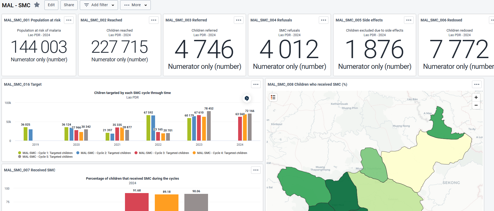

# Seasonal Malaria Chemoprevention (SMC) System Design Guide { #mal-smc-design }

## Background and Purpose

Seasonal Malaria Chemoprevention (SMC) is a preventive strategy recommended by the World Health Organization (WHO) to
reduce malaria cases and mortality among children under five in areas with highly seasonal malaria transmission. The
approach involves the administration of antimalarial drugs during peak transmission periods, ensuring high coverage and
adherence within target populations. Effective monitoring and evaluation of SMC programs are crucial to assess their
impact, optimize delivery, and ensure resources are efficiently allocated.

The SMC DHIS2 dataset is designed to streamline the collection, analysis, and reporting of key data related to SMC
campaigns. It serves as a central repository for tracking performance indicators, such as coverage rates, stock
management, adverse drug reactions, and demographic insights. This dataset enables health professionals, policymakers,
and stakeholders to make evidence-based decisions, ensuring the sustainability and effectiveness of SMC interventions.
By leveraging DHIS2’s robust data management capabilities, the dataset fosters transparency, accountability, and
collaboration across all levels of the health system.

This dataset forms a critical component of the design guide, providing the foundational data structure for monitoring,
evaluating, and enhancing seasonal malaria chemoprevention efforts.

## System Design Overview

### Package Structure

The toolkit includes **one single weekly dataset “MAL-SMC - Seasonal Malaria Chemoprevention”**. The dataset is divided
into 5 sections (presented as tabs for clarity), one per SMC cycle.

The data elements, disaggregated by age and sex, are virtually the same across all cycles, with the sole divergence
being in cycle number 5, where it is requested to report the number of children who received all the doses in all the
cycles.

### Analytics

The dataset includes two data elements with date value type to report the start and end date of each cycle. In DHIS2,
data elements of type "date" cannot be directly used for analysis in graphs or calculated in analytics because they are
treated as raw date values, not numerical or categorical data.

Since dates are not numeric, one cannot calculate differences, durations, or other computations directly in DHIS2
analytics. Should there be the need to calculate or manipulate date values (e.g., the difference between two dates), you
can use external tools like Excel, custom SQL queries, or scripts via the DHIS2 Web API.

## Dashboard

The MAL-SMC Dashboard provides essential visualizations for monitoring the performance of Seasonal Malaria
Chemoprevention (SMC) cycles across time and geographic regions. Given the critical importance of triangulating routine
malaria data for monitoring, evaluating impact, and planning distributions, the dashboard integrates key indicators from
the DHIS2 Malaria Toolkit alongside SMC metadata.

It is important to note that these indicators are already included in the Malaria Toolkit and, therefore, are not
duplicated in the SMC metadata package. The indicators are specified in the table below alongside the corresponding
visualizations where they appear:

| Malaria routine indicators                                                                                                      | SMC dashboard visualizations       |
|---------------------------------------------------------------------------------------------------------------------------------|------------------------------------|
| MAL - Population at risk for malaria                                                                                            | MAL_SMC_001 Population at risk     |
| MAL - Confirmed malaria cases per 1,000  MAL - Cases confirmed (actual period) MAL - Suspected malaria cases              | MAL_SMC_013 U5 suspected confirmed |
| MAL - Inpatient cases (actual period) MAL - Inpatient malaria mortality rate (per 100,000)   MAL - Deaths (actual period) | MAL_SMC_014 IPD and mortality      |                                |
| MAL - Suspected cases (actual period)   MAL - Cases confirmed (actual period)                                                | MAL_SMC_015 cases and SMC          |

These indicators are pivotal for triangulating routine malaria data with the impact of SMC interventions. They support
visualizations that, although not packaged in the SMC metadata, are critical for comprehensive monitoring and
evaluation. These visualizations are exemplified in the [DHIS2 HMIS Demo](https://demos.dhis2.org/hmis), showcasing how
routine malaria indicators and SMC data combine to deliver a robust and well-rounded monitoring dashboard.

## References

WHO, 2023. Seasonal malaria chemoprevention with sulfadoxine–pyrimethamine plus amodiaquine in children: a field guide
URL: [https://www.who.int/publications/i/item/9789240073692?](https://iris.who.int/handle/10665/368123)

WHO guidelines for malaria.
URL: [https://iris.who.int/handle/10665/354781](https://app.magicapp.org/#/guideline/LwRMXj)
